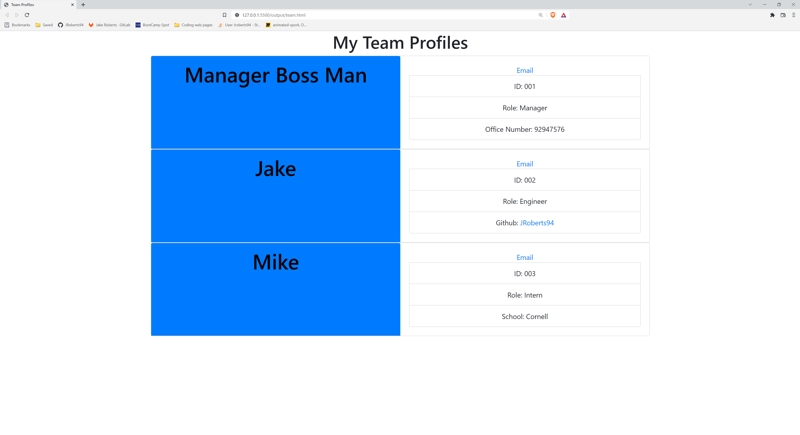

# Team Profile Generator

## Table of Contents 
- [Description](#description)
- [Licensing info](#license)
- [Questions + Contact](#questions)
- [Demo](#demo)

## Demo
[demo](https://watch.screencastify.com/v/O4Em6h4b1KV7JwKomDDZ)

## Description
This weeks task was to create a Team Profile Generator, to easily manage your employees/ collegues information all in one place using the command/ terminal.

## Links
* [Link to github Repository](https://github.com/JRoberts94/Week10-Team-Profile-Generator)
* 

## Installation Instructions
Start by cloning the repository to yoour local machine
   
 open the folder in VScode (or a coding app similiar) 
   
 in the console, type npm install 
   
 type: node app.js to run the file in the command console.

## Usage Information
for personal or prefessional usage

## License

 
[License information](https://opensource.org/licenses)

## Contributing
this is an open source project, you may use and change at your own leisure

## Test Instructions
in command console, type npm i or npm install   then once dependencies are downloaded type "npm test" to run the tests/ test suites

## Questions
feel free to contact me, for any questions or improvements you think of

Visit my GitHub profile here: [JRoberts94](https://github.com/JRoberts94)
 
Email: jake.shaun.roberts1994@gmail.com

## Technology used
javascript   node.js   HTML   CSS   Bootstrap
